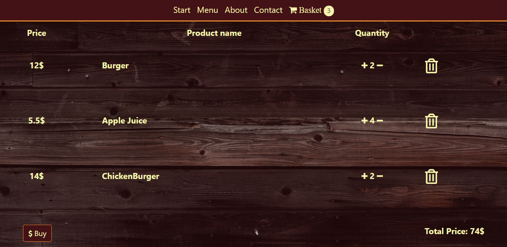
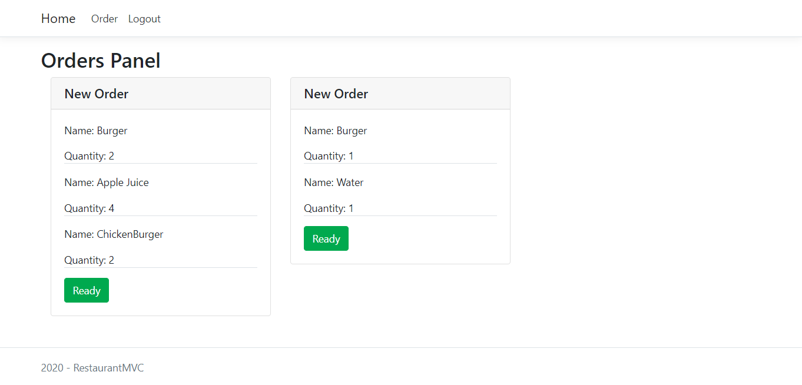
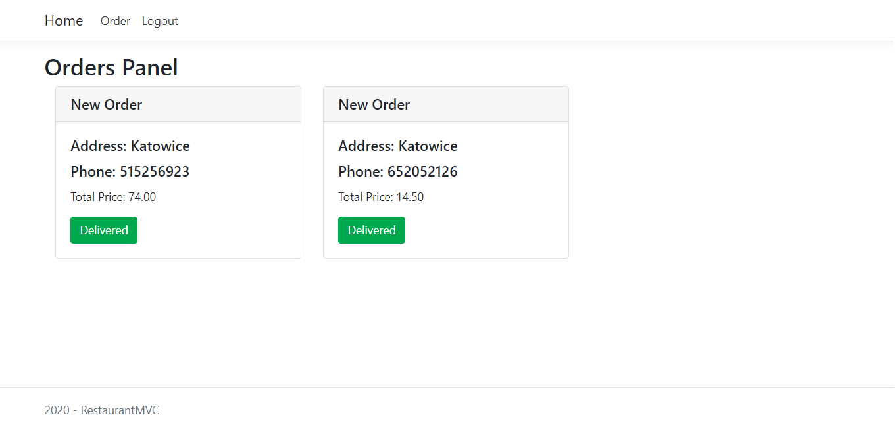

# RestaurantApp

My #3 project.

## Table of contents

- [General info](#general-info)
- [Features](#features)
- [Screenshots](#screenshots)
- [Technologies](#technologies)
- [Setup](#setup)

## General info

Restaurant app where client can order food.
Angular - Client side.
MVC - Employee side.

## Features

- Angular - Choose meals and add to basket.
- Angular - Make order from basket.
- MVC Admin - Manage account and menu (create, read, delete).
- MVC Kitchen - Get orders from client side, and push ready orders to restaurant.
- MVC Restaurant - Get orders from kitchen.
- Sending orders is connected with SignalR and RabbitMQ.

## Screenshots

- Client
  

- Employee Kitchen
  

- Employee Restaurant
  

## Technologies

- ASP.NET Core API.
- ASP.NET MVC
- Angular.
- SQL Server.
- Docker.

## Setup
Requirements:
* Docker

To run App open Restaurant.sln with Visual Studio, right click on docker-compose Set as Startup Project and press F5.

http://localhost:5050/ MVC Employee Side

http://localhost:5150/ Angular Client Side

MVC Passwords:

- admin/Admin123
- kitchen/Kitchen123
- restaurant/Restaurant123
